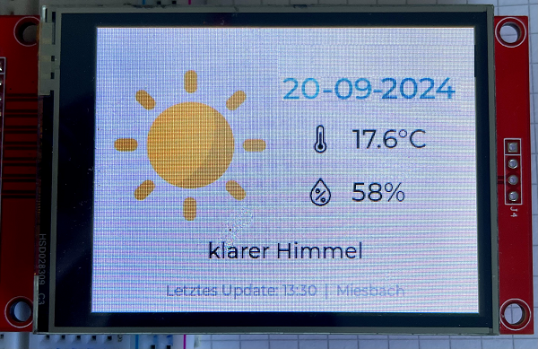

# Wetterstation_LVGL
ESP32, TFT 2.8", Light and Versatile Graphics Library

  |[:skull:ISSUE](https://github.com/frankyhub/Wetterstation_LVGL/issues?q=is%3Aissue)|[:speech_balloon: Forum /Discussion](https://github.com/frankyhub/Wetterstation_LVGL/discussions)|[:grey_question:WiKi](https://github.com/frankyhub/Wetterstation_LVGL/wiki)|
|--|--|--|
| | | |
||||
||| |

## ESP32 - TFT 2.8 Wetterdaten

## Verdrahtung

| TFT LCD | ESP32 | 
| -------- | -------- | 
| T_IRQ	|   GPIO 36| 
| T_OUT	|   GPIO 39| 
| T_DIN| 	  GPIO 32| 
| T_CS	 |  GPIO 33| 
| T_CLK	 |  GPIO 25| 
| SDO(MISO)| 	GPIO 12| 
| LED	|   GPIO 21| 
| SCK	|   GPIO 14| 
| SDI(MOSI)| 	GPIO 13| 
| D/C| 	  GPIO 2| 
| RESET| 	EN/RESET| 
| CS	|   GPIO 15| 
| GND	|   GND| 
| VCC	|   5V (or 3.3V)*| 
| -------- | -------- | 
| *| | 
| VCC = 5V | J1=OPEN| 
| VCC = 3.3V | J1=CLOSE| 
| -------- | -------- | 

Danke an https://randomnerdtutorials.com/

---

   
<ol class="breadcrumb" style="border-top: 2px solid black;border-bottom:2px solid black; height: 45px; width: 900px;"> 
<a href="#oben">nach oben</a>
</ol>

  

---
